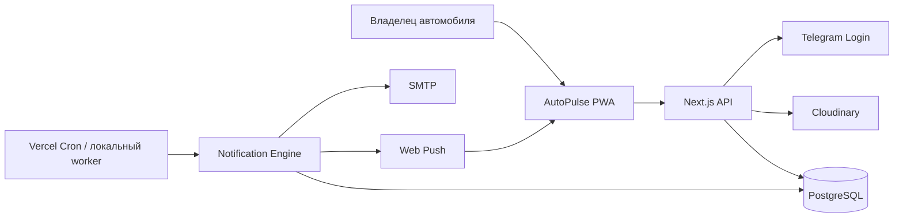
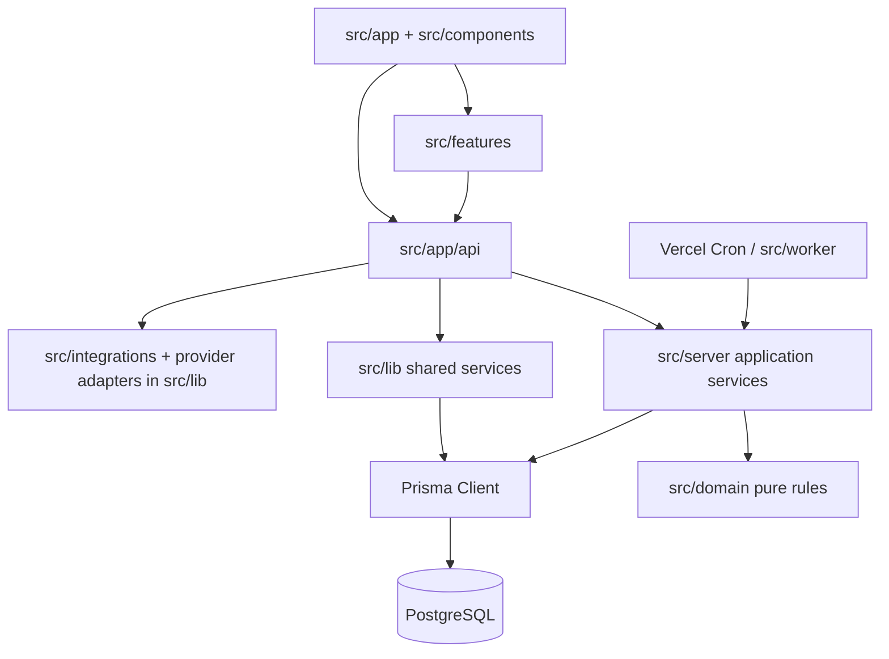
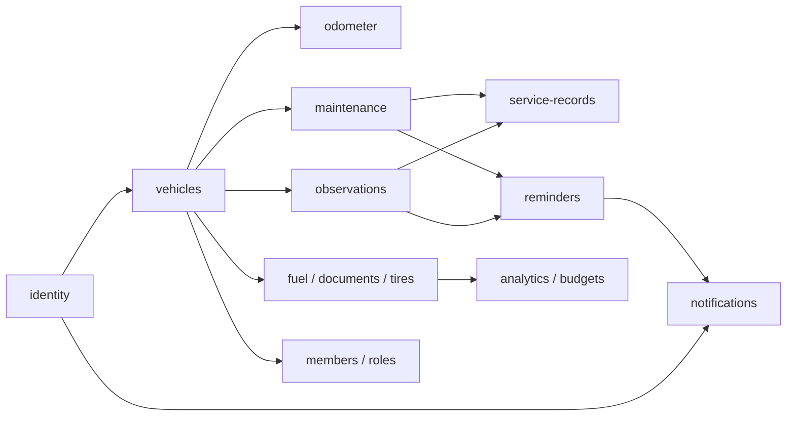

# Архитектура AutoPulse

## 1. Назначение

AutoPulse — PWA-приложение для контроля автомобилей, пробега,
планов обслуживания, наблюдений, истории работ, заправок, документов, шин,
расходов и напоминаний. Приложение не
является системой технической диагностики.

## 2. Контекст системы

## 3. Технологии и runtime-компоненты

- Next.js 16, React 19, TypeScript и Tailwind CSS;
- PostgreSQL 15+ и Prisma;
- Vercel Cron либо локальный Node.js worker;
- Cloudinary, SMTP, Web Push, Telegram Login Widget и OCR.Space как
  опциональные интеграции.

| Компонент | Ответственность |
| --- | --- |
| Web/PWA | страницы App Router, формы, навигация, service worker |
| API | HTTP-контракты, аутентификация, валидация и вызов прикладных сервисов |
| Domain | расчёт статусов, readiness score и правила обслуживания |
| Data | Prisma Client, транзакции, PostgreSQL |
| Jobs | генерация и доставка уведомлений |
| Integrations | Cloudinary, Telegram, SMTP, Web Push |

## 4. Реализованная модульная архитектура

Код уже разделён по предметным слоям, но переход от исторических `src/lib`
сервисов к `src/server` и `src/integrations` выполняется постепенно. Новую
бизнес-логику следует добавлять в domain/application-слои, а не расширять
route handler.

### Правило зависимостей

- UI не импортирует Prisma, серверные сервисы или секреты.
- Route handler не должен содержать бизнес-транзакцию; он отвечает за HTTP, Zod и
  преобразование ошибок.
- Application service координирует ownership, транзакции и побочные эффекты.
- Domain содержит чистые функции без Next.js и Prisma.
- Prisma-запросы инкапсулируются в application service по мере декомпозиции и
  не должны формировать HTTP-ответы.
- Integration adapter изолирует внешнего провайдера и имеет интерфейс,
  пригодный для тестовой подмены.

## 5. Доменные модули

| Модуль | Инварианты |
| --- | --- |
| identity | безопасная сессия, уникальный username, проверенный Telegram payload |
| vehicles | ресурс имеет владельца и может быть доступен viewer/editor участникам |
| odometer | уменьшение только как correction с обязательной причиной |
| maintenance | следующий срок и статус рассчитываются единым domain engine |
| observations | связанные план и сервисная запись принадлежат тому же автомобилю |
| service-records | подтверждение/void атомарны и оставляют audit trail |
| reminders | правило привязано к доступному плану или наблюдению |
| notifications | `dedupeKey` уникален, доставка идемпотентна |
| money | USD/BYN/RUB/EUR агрегируются отдельно, неявная конвертация запрещена |
| ownership | пробег шин и заправок согласован с текущим пробегом автомобиля |

## 6. Транзакционные границы

Одна Prisma-транзакция обязательна для:

- создания ServiceRecord, снапшотов, обновления планов и пробега;
- void ServiceRecord и пересчёта последних подтверждённых работ;
- закрытия Observation вместе с проверкой связанного ServiceRecord;
- создания Notification с дедупликацией.

Отправка email/push не должна удерживать транзакцию. В БД сначала фиксируется
состояние доставки, затем внешний адаптер выполняет отправку и записывает
результат.

## 7. Ограничения размера

- page/route orchestration: до 250 строк;
- React-компонент: целевой размер до 200 строк;
- application service: до 300 строк;
- чистая domain-функция: одна ответственность;
- файл больше лимита требует декомпозиции либо обоснования в ADR.
