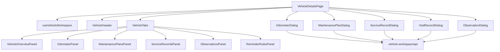

# План декомпозиции крупных файлов

> Статус: основная декомпозиция vehicle workspace реализована. Таблицы
> «целевой структуры» ниже остаются правилами для дальнейшего упрощения
> исторических страниц и route handlers.

## 1. Принцип

Декомпозиция выполняется вертикальными feature-модулями. Общая папка
`components/` используется только для действительно переиспользуемых элементов,
а бизнес-компоненты располагаются рядом со своей feature.

## 2. Целевая frontend-структура

```text
src/
  app/
    vehicles/[id]/page.tsx
    dashboard/page.tsx
  components/
    ui/
    layout/
  features/
    vehicles/
      api/
      components/
      hooks/
      schemas/
      types.ts
    odometer/
    maintenance/
    service-records/
    observations/
    reminders/
    notifications/
    settings/
  domain/
    maintenance/
    odometer/
```

## 3. `vehicles/[id]/page.tsx`

Исходный размер составлял 2133 строки. После выделения панелей и форм страница
содержит около 230 строк и выполняет только роль координатора.



Реализованные файлы:

- `features/vehicle-workspace/hooks/useVehicleWorkspace.ts`;
- `features/vehicle-workspace/api/client.ts`;
- `features/vehicle-workspace/api/actions.ts`;
- `features/vehicle-workspace/components/WorkspaceDialog.tsx`;
- `features/vehicle-workspace/forms/OdometerDialog.tsx`;
- `features/vehicle-workspace/forms/MaintenancePlanDialog.tsx`;
- `features/vehicle-workspace/forms/ServiceRecordDialog.tsx`;
- `features/vehicle-workspace/forms/VoidRecordDialog.tsx`;
- `features/vehicle-workspace/forms/ObservationDialog.tsx`;
- ранее выделенные header, tabs и три панели workspace.

### Контракт диалогов

Каждый диалог:

1. получает только необходимые идентификаторы и справочные данные;
2. владеет draft формы, локальными ошибками и `isSubmitting`;
3. валидирует payload общей Zod-схемой;
4. вызывает типизированный API client;
5. вызывает `onSaved`, чтобы координатор обновил workspace;
6. закрывается только после успешного обновления данных.

`WorkspaceDialog` централизует modal semantics, закрытие по Escape и клику по
фону, доступное имя кнопки закрытия и минимальный touch target.

## 4. Остальные страницы

| Исходный файл | Целевые модули |
| --- | --- |
| `maintenance/page.tsx` | `MaintenanceFilters`, `PlanList`, `PlanCard`, `PlanEditor`, `useMaintenancePlans` |
| `dashboard/page.tsx` | `VehicleSelector`, `ReadinessPanel`, `ActionGroups`, `ExpenseSummary`, `OdometerQuickUpdate`, `useDashboard` |
| `vehicles/page.tsx` | `VehicleList`, `VehicleCard`, `VehicleForm`, `ArchiveVehicleDialog`, `useVehicles` |
| `observations/page.tsx` | `ObservationFilters`, `ObservationList`, `ObservationEditor`, `useObservations` |
| `notifications/page.tsx` | `NotificationFilters`, `NotificationList`, `NotificationItem`, `useNotifications` |
| `settings/page.tsx` | `ProfileForm`, `ReminderPreferencesForm`, `PushSettings`, `DangerZone` |
| `history/page.tsx` | `HistoryFilters`, `ServiceRecordList`, `ServiceRecordSummary` |

## 5. Управление состоянием

- серверные данные загружает feature hook;
- форма хранит только собственный draft;
- выбор открытого modal/sheet остаётся в странице-координаторе;
- draft и состояние отправки находятся внутри конкретного диалога;
- derived data вычисляется через чистые selectors, а не дублируется в state;
- API errors преобразуются в единый `ClientApiError`;
- после mutation обновляется только затронутый feature cache/state.

На первом этапе дополнительная state/query библиотека не обязательна. Решение о
TanStack Query принимается отдельным ADR после стабилизации API.

## 6. Целевая backend-структура

```text
src/
  domain/
    maintenance/status-engine.ts
    odometer/rules.ts
    notifications/dedupe.ts
  server/
    shared/api-error.ts
    shared/ownership.ts
    vehicles/
    observations/
      observation.service.ts
      observation.repository.ts
      observation.schemas.ts
    service-records/
      service-record.service.ts
      service-record.repository.ts
    notifications/
      generation.service.ts
      delivery.service.ts
  integrations/
    telegram/login-widget.ts
    cloudinary/image-storage.ts
    email/smtp-sender.ts
    web-push/web-push-sender.ts
  jobs/
    notification-cron.ts
```

## 7. Пример тонкого route handler

Route handler должен выполнять только:

1. извлечение session user;
2. разбор path/query/body;
3. Zod validation;
4. вызов application service;
5. преобразование результата или `ApiError` в HTTP.

Ownership, Prisma-транзакции, audit и пересчёт связанных сущностей находятся в
application service и тестируются без Next.js.

## 8. Проверка реализации

- unit-тест API client проверяет успешный ответ и преобразование field errors;
- Playwright проверяет открытие форм, локальную валидацию, успешное сохранение
  наблюдения и сброс draft при повторном открытии;
- обязательны lint, typecheck, unit, integration, production build и E2E.

## 9. Безопасный порядок рефакторинга

- не переименовывать публичный API во время первого extraction commit;
- сначала переносить код без изменения поведения;
- после каждого extraction запускать все проверки;
- новые тесты добавлять до исправления найденного дефекта;
- удалять старый код только после parity-теста;
- не создавать универсальные abstractions до появления минимум двух реальных
  потребителей.
