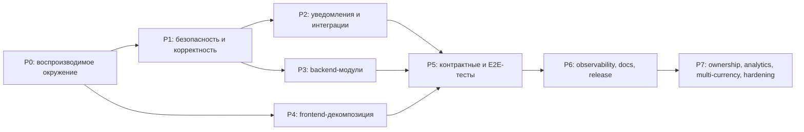

# План реализации и стабилизации

> Архивный исполнимый план. Этапы P0–P7 завершены; фактический результат и
> проверки зафиксированы в [completion-report.md](completion-report.md).

## 1. Цель

Довести AutoPulse от функционального MVP до проверяемого production-релиза,
устранив известные ошибки, закрыв риски безопасности и разложив монолитные
страницы по предметным модулям без изменения пользовательского поведения.

## 2. Граф зависимостей

| Этап | Статус |
| --- | --- |
| P0–P6 | Завершено |
| P7 | Завершено |

## 3. Этап P0 — базовая воспроизводимость

Результат: любой разработчик и CI получают одинаковый зелёный baseline.

- исправить ESLint error в `LoginForm`;
- удалить или использовать три неиспользуемых значения;
- добавить отдельную test database и команду её подготовки;
- улучшить preflight: проверять существование БД и применённые миграции, а не
  только открытый TCP-порт;
- добавить Prisma config вместо deprecated `package.json#prisma`;
- синхронизировать README, `.env.example` и документацию;
- создать CI pipeline: install → generate → lint → typecheck → unit →
  integration → build.

Критерии приёмки:

- все локальные проверки проходят одной командой;
- интеграционные тесты не используют production/development БД;
- ошибка окружения объясняет точную команду восстановления.

## 4. Этап P1 — критическая безопасность и корректность

### P1.1 Cron

- добавить расписание в `vercel.json`;
- исключить cron route из cookie-only ветки proxy либо валидировать
  `Authorization: Bearer CRON_SECRET` непосредственно в proxy;
- оставить повторную проверку секрета в route handler;
- добавить тесты: без секрета, неверный секрет, корректный секрет, повторный
  идемпотентный запуск.

### P1.2 Observation

- унифицировать контракт закрытия: рекомендуемый
  `POST /api/observations/:id/close`;
- создать настоящий nested route или изменить клиента на документированный
  endpoint;
- проверять, что `maintenancePlanId` и `serviceRecordId` принадлежат тому же
  автомобилю и текущему пользователю;
- выполнять update и audit в одной транзакции;
- добавить отрицательные ownership-тесты.

### P1.3 Telegram authentication

- реализовать алгоритм именно для Telegram Login Widget;
- использовать `timingSafeEqual`;
- отклонять старый `auth_date` по документированному TTL;
- отделить Login Widget DTO от Telegram WebApp DTO;
- покрыть валидными/невалидными тестовыми векторами;
- добавить rate limiting для auth endpoints.

### P1.4 JWT и сессия

- запретить fallback-секрет в production;
- проверять обязательные claims и алгоритм JWT;
- убрать токен из JSON-ответа, если используется HttpOnly cookie;
- добавить logout/revocation strategy;
- определить правила смены секрета и завершения активных сессий.

### P1.5 Пробег и сервисные записи

- вынести правило пробега в единый application service;
- запретить подтверждённую работу с пробегом ниже текущего, либо требовать
  отдельную correction-команду с причиной;
- гарантировать согласованность Vehicle, OdometerReading и
  MaintenancePlan.lastCompletedMileage;
- проверить хронологию `performedAt`;
- добавить route-level тесты на rollback транзакции.

## 5. Этап P2 — уведомления и внешние интеграции

- создать миграцию `PushSubscription` с FK и индексом `userId`;
- разделить генерацию, планирование и доставку уведомлений;
- сделать доставку повторяемой и устойчивой к частичным ошибкам;
- не помечать push как `sent` до подтверждённой отправки;
- реализовать состояния `pending → processing → sent/failed`;
- добавить retry/backoff и ограничение числа попыток;
- формализовать каналы `in_app`, `push`, `email`; Telegram notification оставить
  feature-flagged до появления адаптера;
- добавить file size, MIME и image dimension limits для Cloudinary upload;
- удалять загруженный файл при отменённой операции, если он больше нигде не
  используется.

Критерии приёмки:

- `prisma migrate deploy` создаёт все используемые таблицы;
- повторный cron не создаёт дублей;
- сбой одного подписчика не ломает доставку остальным;
- секреты внешних сервисов отсутствуют в клиентском bundle и логах.

## 6. Этап P3 — декомпозиция backend

- ввести `src/domain`, `src/server` и `src/integrations`;
- перенести транзакции ServiceRecord, Observation и Reminder в application
  services;
- унифицировать `ApiError` и преобразование ошибок в HTTP;
- вынести ownership helpers и запрещённые cross-vehicle связи;
- оставить route handlers тонкими;
- добавить индексы под реальные запросы после фиксации query inventory.

Подробная карта — в [modularization.md](modularization.md).

## 7. Этап P4 — декомпозиция frontend

Порядок: `vehicles/[id]` → `maintenance` → `dashboard` → `vehicles` →
`observations` → `notifications` → `settings/history`.

Для каждой страницы:

1. зафиксировать текущее поведение smoke-тестами;
2. вынести типы и API client;
3. вынести stateful feature hooks;
4. вынести формы и панели;
5. оставить page как composition root;
6. повторить lint/typecheck/unit/build и visual smoke test.

Запрещено одновременно менять API-контракт, дизайн и структуру компонента без
отдельных тестов: это затрудняет обнаружение регрессии.

## 8. Этап P5 — тестовое покрытие

- unit-тесты domain;
- application tests с тестовой PostgreSQL;
- route contract tests с реальной авторизацией;
- E2E: регистрация, автомобиль, пробег, план, наблюдение, ServiceRecord, void,
  notification;
- security regression tests на IDOR;
- migration tests с пустой и предыдущей схемой;
- PWA smoke tests: manifest, service worker, subscription lifecycle.

## 9. Этап P6 — эксплуатация и релиз

- structured logging с request/job correlation ID;
- health/readiness endpoint без утечки конфигурации;
- метрики cron, notification delivery и API error rate;
- Sentry или эквивалент для server/client exceptions;
- резервное копирование и проверенный restore;
- staging release, smoke test, production deployment, post-deploy verification;
- финальная синхронизация README и runbooks.

## 10. Рекомендуемые инкременты

| Инкремент | Содержание | Риск |
| --- | --- | --- |
| 1 | baseline, CI, test DB, lint | низкий |
| 2 | cron + PushSubscription migration | высокий |
| 3 | observation route + ownership | высокий |
| 4 | Telegram + JWT hardening | высокий |
| 5 | odometer/service-record invariants | высокий |
| 6 | notification delivery state machine | средний |
| 7 | backend modules | средний |
| 8–10 | frontend decomposition по страницам | средний |
| 11 | E2E, observability, release docs | средний |

Каждый инкремент должен быть отдельным reviewable PR без несвязанных изменений.

## 11. Этап P7 — эксплуатация и аналитика

- раздельный учёт USD, BYN, RUB и EUR без неявной конвертации;
- топливо, документы, комплекты шин и напоминания об окончании документов;
- роли owner/editor/viewer;
- аналитика, годовые бюджеты и прогноз;
- JSON import, JSON/CSV/PDF export и OCR чеков;
- durable rate limit, отзыв сессий и шифрование VIN/госномера;
- мобильная навигация из пяти основных действий и E2E на двух viewport.

Этап завершён. Дальнейшие продуктовые задачи оформляются новой roadmap или ADR,
а не дописываются задним числом в P0–P7.
