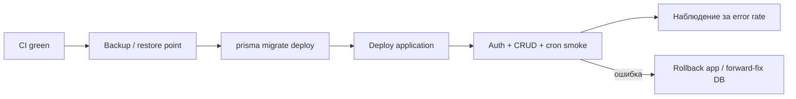

# Эксплуатация и деплой

## 1. Окружения

| Окружение | Назначение | База |
| --- | --- | --- |
| local | разработка | локальная PostgreSQL |
| test | integration/contract tests | отдельная disposable БД |
| staging | миграции и release smoke | отдельный проект/БД |
| production | пользовательский трафик | production PostgreSQL |

Ни test, ни staging не должны использовать production credentials.

## 2. Переменные окружения

Core-переменные, без которых production startup завершается с ошибкой:

- `DATABASE_URL`;
- `JWT_SECRET`;
- `DATA_ENCRYPTION_KEY` — отдельный стабильный секрет для VIN и госномеров;
- `CRON_SECRET`.

Для миграций также нужен `DIRECT_URL`. Он может совпадать с `DATABASE_URL` в
обычной PostgreSQL или указывать на direct/non-pooling connection у serverless
провайдера.

Опциональные интеграции:

| Возможность | Переменные |
| --- | --- |
| Web Push | `NEXT_PUBLIC_VAPID_PUBLIC_KEY`, `VAPID_PRIVATE_KEY`, `VAPID_SUBJECT` |
| Загрузка изображений | `CLOUDINARY_CLOUD_NAME`, `CLOUDINARY_API_KEY`, `CLOUDINARY_API_SECRET` |
| Telegram Login | `TELEGRAM_BOT_TOKEN`, `NEXT_PUBLIC_TELEGRAM_BOT_USERNAME` |
| Email | `SMTP_HOST`, `SMTP_PORT`, `SMTP_USER`, `SMTP_PASS`, `SMTP_FROM`, `SMTP_FROM_NAME` |
| OCR чеков | `OCR_SPACE_API_KEY` |
| Ссылки в email | `NEXT_PUBLIC_APP_URL` |

Без опциональной группы соответствующая возможность возвращает понятную ошибку
или остаётся выключенной. `/api/health` сообщает доступность БД и состояние
основных интеграций, не раскрывая значения секретов.

## 3. Release flow



Миграции проектируются как forward-compatible. Откат приложения не должен
требовать разрушительного отката схемы.

Рекомендуемая последовательность проверок перед выкладкой:

```bash
npm ci
npx prisma validate
npm run test:prepare
npm run verify
npm audit --audit-level=high
```

После создания backup:

```bash
npx prisma migrate deploy
```

## 4. Cron runbook

Проверить:

1. `vercel.json` содержит расписание `/api/cron/notifications`;
2. Vercel и приложение используют одинаковый `CRON_SECRET`;
3. proxy пропускает cron bearer auth;
4. route повторно валидирует секрет;
5. structured logs показывают время запуска и `created/sent/failed`;
6. повторный ручной запуск не создаёт дублей.

## 5. Database runbook

- до миграции создать backup/restore point;
- применить `prisma migrate deploy`, не `db push`;
- после первого включения `DATA_ENCRYPTION_KEY` выполнить `npm run encrypt-sensitive-data`
  для ранее сохранённых VIN и госномеров;
- не менять `DATA_ENCRYPTION_KEY` без процедуры расшифровки старым ключом и
  повторного шифрования новым;
- выполнить migration smoke queries;
- проверить таблицы, FK и индексы;
- при несовместимости остановить rollout и выполнить forward-fix migration.

## 6. Docker Compose

Локальную PostgreSQL можно запустить отдельно:

```bash
docker compose up -d postgres
```

Полный self-hosted стек:

```bash
docker compose up -d --build
```

Значения секретов в `docker-compose.yml` предназначены только для локального
запуска. Для реального self-hosted production передавайте секреты через
защищённый environment/secrets store.

## 7. Наблюдаемость

Минимальные production-сигналы во внешней платформе мониторинга:

- HTTP error rate по route и error code;
- latency p50/p95;
- cron last success и duration;
- notifications created/sent/failed;
- invalid/expired push subscriptions;
- auth failures и rate-limit events;
- database connection errors.

Логи должны быть структурированными, содержать request/job correlation ID и не
содержать cookie, JWT, пароли, Telegram hash, VAPID/SMTP/Cloudinary secrets.

В репозитории реализованы health endpoint и structured cron logs. Хранение
метрик, алерты и error tracking настраиваются на платформе деплоя.
