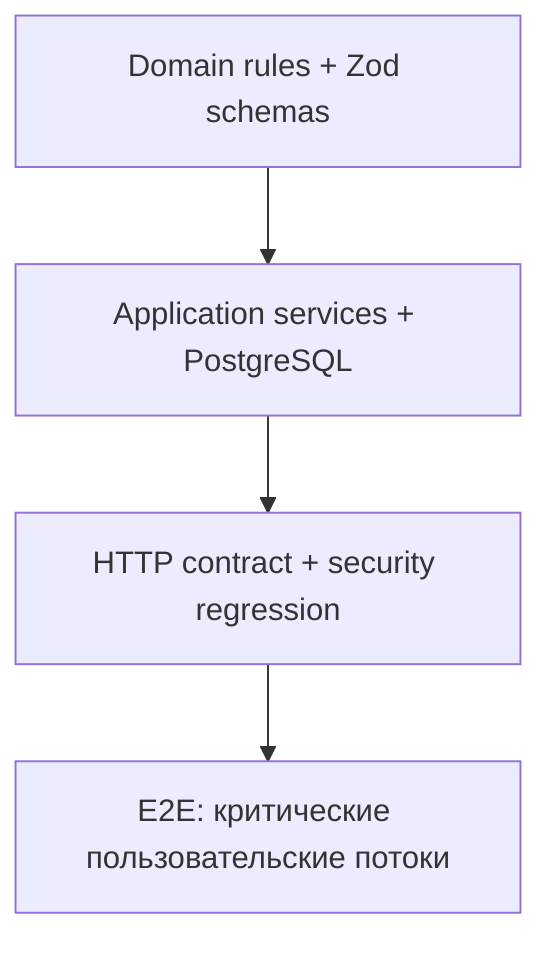

# Стратегия тестирования

## 1. Пирамида



## 2. Уровни

### Unit

- status engine и readiness score;
- odometer rules;
- notification dedupe/state transition;
- Telegram payload verification;
- Zod schemas и error mapping.

Не используют сеть, Next.js request context или БД.

### Integration

- запускаются только на отдельной test database;
- применяют реальные миграции;
- проверяют application services и Prisma-транзакции;
- после теста очищают данные или используют изолированную схему.

### Contract

- вызывают route handlers через HTTP;
- используют настоящую session cookie;
- проверяют status, error code и response schema;
- обязательно покрывают proxy и ownership.

### E2E

Текущий Playwright-набор запускается для Desktop Chrome и Pixel 5 и проверяет:

1. регистрация и вход;
2. создание автомобиля;
3. валидация и сохранение форм пробега, плана, наблюдения и сервисной записи;
4. сброс локального состояния диалогов;
5. раздельный учёт валют;
6. журнал эксплуатации и PDF-экспорт;
7. публичный health endpoint.

Идемпотентность cron, ownership/IDOR, Telegram payload, коррекция пробега,
ServiceRecord/void и отмена уведомлений покрываются unit/integration-тестами.
Push lifecycle и удаление аккаунта остаются кандидатами на расширение E2E.

## 3. Миграционные тесты

- пустая БД → все миграции → schema check;
- snapshot предыдущего релиза → migrate deploy → smoke test;
- проверка FK, unique constraints и необходимых индексов;
- отдельная проверка наличия `PushSubscription`.

## 4. CI quality gates

Обязательные блокирующие шаги:

```text
npm ci
npx prisma generate
npx prisma migrate deploy
npm run lint
npm run typecheck
npm run test:unit
npm run test:integration
npm run build
npm run test:e2e
```

Именно эти шаги выполняет текущий GitHub Actions workflow. Нельзя считать
`next build` заменой отдельной проверки ESLint.

## 5. Политика регрессий

Любой найденный дефект сначала воспроизводится тестом. Исправление принимается,
когда новый тест падает на старом коде, проходит на новом и не ослабляет
существующие assertions.
